Creadors: Paula Muncunill i Pol Naharro
## INFORME: INTERNET RADIO

##### Objectiu

L’objectiu d’aquest projecte és poder reproduir el contingut d’una emissora ràdio a través d’una pàgina web pròpia utilitzant l’ESP32. Aquesta reproducció seria com una ràdio de veritat, és a dir, l’usuari introdueix un enllaç d’una ràdio i pot regular el volum d’aquesta. A part també pot canviar d’emissora en qualsevol moment i variar d’emissores mp3 i acc. 

##### Material
-Processador ESP32 (https://www.amazon.es/dp/B071P98VTG/ref=cm_sw_r_wa_api_glt_i_VKNGY19JVYY1CT7TR3SX?_encoding=UTF8&psc=1)

-Altavoz HAJIA 2W  8 Ohm (https://www.amazon.es/dp/B073TSC7RW?ref=ppx_pop_mob_ap_share)

-iHaospace MAX98357 I2S Audio Amplifier (https://www.amazon.es/dp/B08JPN1RBR/ref=cm_sw_r_wa_api_glt_i_JXZJ8Z06HM0CMXZ1QSP4?_encoding=UTF8&psc=1)

-2 cables tipus Breadboard Jumper Wire

-5 cables tipus Female-to-Male Dupont Wire

-Un ordinador

-Breadboard

-Cable USB (funció: connectar ESP32 amb ordinador)

##### Descripció codi

Primer de tot trobem les llibreries que necessitarem perquè el codi funcioni, i seguidament definim l’ID i la contrasenya de la xarxa wifi a la qual connectarem l’ESP32, i es defineixen 5 objectes, un servidor del tipus WiFiServer, un decodificador (AudioGenerator), un fitxer (AudioFIleSourceICYStream), un senyal d’entrada buff (AudioFileSourceBUffer) i un senyal de sortida (AudioOutputI2S). En aquesta primera part també es defineixen diverses variables que seran útils al llarg del programa.

El següent pas és la definició de l’estructura que tindrà la pàgina web que s’obrirà des del nostre servidor. Primer tenim el HEAD que en quant obrim mostrarà el títol de la pàgina web “ESP32 Web Radio by Paula i Pol”. També hi ha tres funcions. La primera és updateTitle que el que farà serà aconseguir el títol de la cançó que estigui sonant en aquell moment i actualitzar-la, per així sempre mostrar la cançó correcta. La segona és showValue que ens mostrarà el volum correcte al moment quan el canviem per la barra. I l’última correspon a updateStatus que ens mostrarà com està la cançó en aquell moment, sigui “Playing” o “Stopped”.

En la part del body comencem amb un text de presentació a la pàgina web  “ESP32 Web Radio by Paula i Pol!”. Tot seguit tenim quatre apartats d’informació respecte a la ràdio. El primer és que està sonant en aquest moment, és a dir, el títol de la cançó actual. El segon és el volum, que aquesta part d’informar també el podem variar nosaltres com usuaris, ja que té una barra que es mou horitzontalment amb valors que comencen en l’1 i acaben en el 150. El tercer és l’estatus que ens diu si està “Playing” o “Stopped”. I per últim està on et diu l’enllaç d’àudio actual.

A continuació tenim l’opció per triar d’emissora. Aquesta part es divideix en tres subparts. La primera és on introduïm el nou url de la ràdio. La segona és on seleccionem si aquesta és mp3 o acc. I l’última és el change, que és el botó per efectuar els canvis de l’url. Per finalitzar l’apartat del body tenim l’opció del stop, que fa que para la ràdio fent així que no soni res. 

Després tenim 7 funcions que treballen amb el nostre objecte client (HandelIndex,HandleStatus, HandleTitle, HandleVolume, HandleChangeURL i RedirectRoIndex).

La primera funció que veiem declarada és HandleIndex que passa per paràmetres “client” definit com a WiFiClient. Aquesta funció té com a objectiu la creació de la pàgina web, és a dir, adjuntar la informació introduïda, sigui per l’usuari o per defecte, amb el disseny que s’ha definit abans al body i head.

HandleStatus i HandleTitle s’ocupen de mostrar al client el títol i l’estat (“Playing” o “Stopped”) de la cançó que estigui sonant en aquell moment.  

Handlevolume mostra el volum amb el guany que s’ha predefinit que estigui aquest, i reencamina l’índex, és a dir, actualitzarà la pàgina, per tant quan s’introdueixi un volum diferent (mitjançant la barra de volum) aquest s’actualitzarà en la web.

HandleChangeURL com el seu nom indica canvia l’url que hi havia pel nou introduït per l’usuari. Aquest pot ser de dues classes, mp3 o acc. Tenint en compte això es fa un if per determinar-ho i així poder reproduir la ràdio nova correctament, i, tot seguit, és reencamina a l'índex amb la funció RedirectToIndex que s’explicarà a continuació. Si no hi hagués url o no estigués correcte es cridaria un WebError que ens portaria a una pàgina nova que indica error.

La funció RedirectToIndex que ja ha estat mencionada en alguna de les prèvies funcions, la seva funció és tornar a carregar l'índex de la pàgina web per tal d’actualitzar possibles canvis introduïts per l’usuari.

StopPlaying és una funció que com bé podem deduir pel nom, el que farà serà parar la cançó tancant el decodificador, el senyal d’entrada i el fitxer. Per últim donarà informació a les variables status i title que la cançó ha estat parada.

HandleStop és la funció que s’ocupa de cridar StopPlaying per aturar la cançó i tornar a carregar l’índex amb la nova informació obtinguda gràcies a RedirectToIndex.

Els voids de MDCallback i StatusCallback tenen la funció d’omplir informació del StartNewURL, per ser més concret de les variables decoder i buff el StatusCallBack, i el file el  MDCallback.

Després d’aquestes definicions per carregar la web correctament trobem una de les funcions principals pel programa: Setup(). Primer es preassigna la memòria que es necessita pel senyal d’entrada i els codecs, en cas que no és preassignessin de forma correcta mostraria un missatge de “Fatal Error”.  Seguidament es defineix la velocitat del monitor i s’hi inicialitza el Serial (Serial.begin(115200); ) i es mostra un missatge “Connecting to wifi” pel terminal. Seguidament s’inicia el wifi, es connecta i una vegada connectat es mostra un URL http:// que serà la corresponent a la nostra ràdio web i s’inicia el servidor. Aquesta web s'iniciarà amb l’URL, el títol, l’estat, el fitxer, el senyal d’entrada (buff) i el decodificador majoritàriament nuls, i el senyal de sortida es definirà com un nou AudioOutputI2S. Per últim, si es donés la situació que ja sabés obert la pàgina web i introduït dades com url i volum aquestes queden guardades en el programa i amb la instrucció LoadSettings les carreguem per no tenir les variables a null com abans.

Just a continuació del Setup està el StartNewURL() que té la funció de quan hi ha un url guardat de l’últim cop que l’usuari ha fet servir la WebRadio o quan l’usuari introdueix un nou per la pàgina web, el programa canviï a aquest. Per això comencem mostrant per pantalla que fem el canvi a l’url guardat i el volum, també guardat, i posem el newUrl un altre cop a false. A continuació mirem la memòria lliure abans i després de fer un StopPlaying, comentat anteriorment, i guardem amb un SaveSettings que es comentarà més endavant. El paquet d’instruccions que ve a continuació segueix l’estructura següent: declaració de la nova variable, informar per pantalla de la seva creació i registre d'informació dintre de la variable declarada. Aquest procés es repeteix per les variables file, buff i decoder. El decoder té la diferència que es posa en marxa amb decoder->begin(buff, out); per després fer un if de si aquest no està en marxa imprimir un error per pantalla i fer un StopPaying. Abans de l’if posem el out amb la ganancia corresponent a la guardada anteriorment. I per finalitzar aquest apartat mostrem per pantalla "Done start new URL".

Aleshores tenim la funció LoadSettings, en aquesta primer definim un objecte del tipus Settings que anomenarem s,  i iniciem l’EEPROM, que es tracta d’una memòria ROM programable i esborrable elèctricament, amb la mateixa mida que el nostre objecte s. A continuació realitzem un bucle on llegim totes les dades guardades en EEPROM i les guardem en ptr. Per tal de carregar els settings primer es comprova si anteriorment hi havia alguna configuració com ara l’URL, el volum o l’AAC. Per comprovar-ho realitzem un for on fem anem guarden en la variable sum les variables anomenades. En cas que sí que hi hagin dades anteriors, s’entra en un if que fa que les noves configuracions passen a definir-se igual que les anteriors i es mostra per pantalla un missatge que diu "Resuming stream from EEPROM: url, type=isAAC, vol=volume" on url és la direcció d’enllaç anterior, isAAC ens diu si és AAC o correspon a MP3 i el volum el nivell de volum definit anteriorment. Per últim es declara newUrl com true per utilitzar-ho més endavant.

El SaveSettings té la funció de guardar les dades a l’EEPROM per poder tornar a començar automàticament. Això vol dir que les últimes dades  introduïdes per l’usuari es guarden pel pròxim cop que s’obri comenci amb aquestes dades en canvi que per defecte que és sense cap enllaç i amb el volum a 100. Com a programació podem veure que en les primeres línies guarda les variables en una nova “s” i amb un bucle for omple la variable s.checksum amb les diferents dades guardades abans (s.url, s.isAAC, s.volume). Després s’inicialitza l’EEPROM i s’introdueix, amb un bucle for, totes les dades guardades dintre de “s” a l’EEPROM amb la següent instrucció (EEPROM.write(i, ptr[i]); ). A continuació ho tanca per acabar el procés. 

PumpDecoder(), aquesta funció el que farà és definir l’estat “Playing” mentre el decodificador existeixi i estigui funcionant, però quan el decodificador no estigui en marxa, o declarat, aquest s’aturarà cridant la funció StopPlaying i imprimirà per pantalla “Stopping decoder”.

Per últim tenim la funció loop(), aquesta es compon de diferents parts i condicions. La primera és un comptador que ens va mostrant pel terminal cada segon que passa amb la memòria lliure en aquell moment.  La segona és una condició de si retryms i la resta de millis amb l’anterior és més gran que 0, el retyms es posa a 0 i el newUrl a true. Tot seguit la següent condició és si existeix un newUrl llavors, això significa que s’ha de fer un canvi d’url i cridar la funció StartNewURL, perquè faci aquest canvi. Després posem al client el servidor habilitat o disponible. Per tercera condició és on cridem la pàgina web si el client i aquesta estan disponibles (si no ho estiguessin el programa en si no ho faria). Aquest té moltes condicions if que corresponen a les funcions esmentades anteriorment (HandelIndex, HandleStatus, HandleTitle, HandleVolume, HandleChangeURL). Com podem veure aquestes condicions el que fan és cridar les funcions anteriors perquè aquestes, si algun paràmetre varia, sigui per l’usuari o per què la cançó ha canviat, ho actualitzin per així sempre tenir la informació correcta en la web i es reprodueixi al volum desitjat la ràdio triada, o es pari si així ho desitja l’usuari. També hi ha una opció per mostrar una pàgina d’error si hi ha algun problema i un while que fa que sempre es llegeixi el que està passant. L’última condició del loop és la de netejar i parar client. També cal comentar que per entremig del loop hi havia PumpDecoders que serveixen per definir l’estatus com ja s’ha comentat abans. 

##### Sortida pel terminal

Sortida inicial (primer cop que es genera):

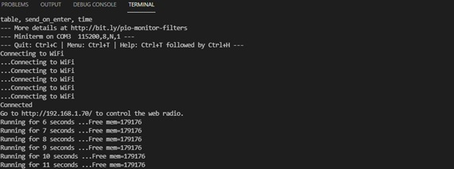

Sortida amb un url ja guardat:

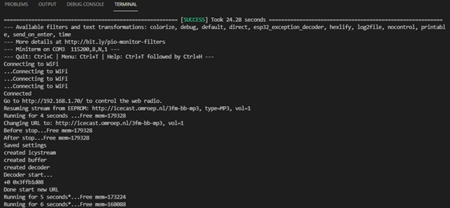

Canvi de volum: (per el exemple primer a 95 i després a 17)

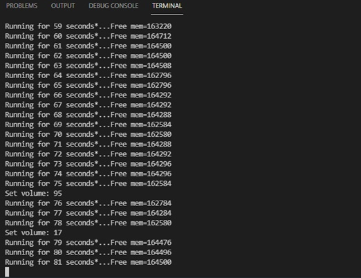

Canvi d’estació de ràdio: (de la http://icecast.omroep.nl/3fm-bb-mp3 a la http://31.192.216.6/rmf_fm)

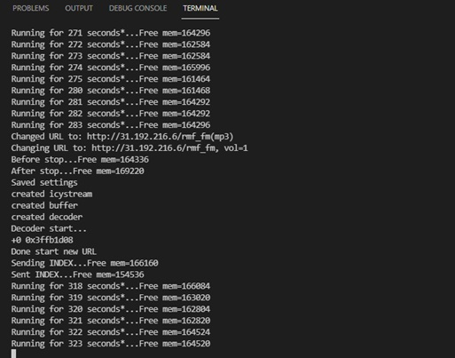

Després de prémer el botó de stop:

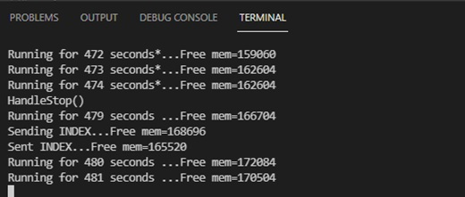

##### Muntatge

En aquest apartat hem fet dos muntatges un amb l’altaveu posat als materials i un altre amb un altaveu millor que disposàvem d’ell per casa. La raó de fer dos és pel fet que amb l’altaveu inicial se sentia una miqueta malament, ja que no és un bon altaveu. En canvi amb el segon veiem una millora de la qualitat de l’àudio tot i que hi ha unes interferències. Les quals ja es trobaven amb el primer altaveu i són causades per la ràdio en si.   

Muntatge altaveu 1:

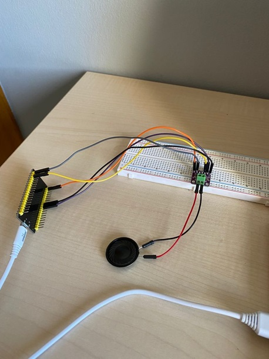
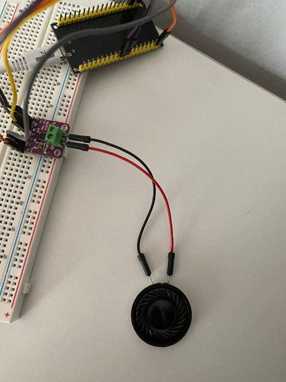

Muntatge altaveu 2:

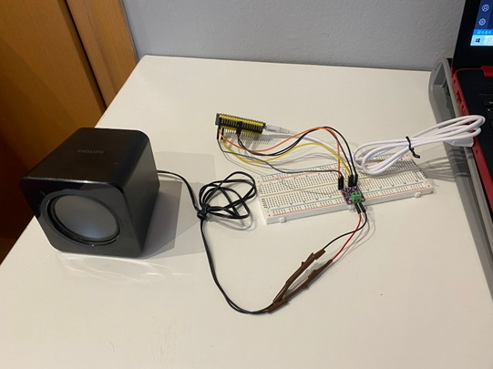
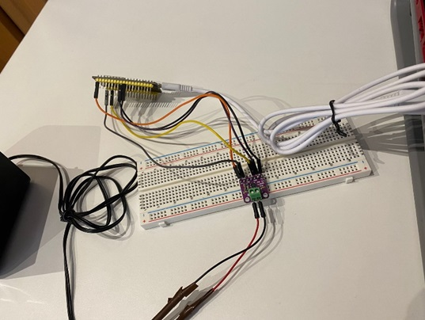

##### Pàgina web

Pàgina web inicial:

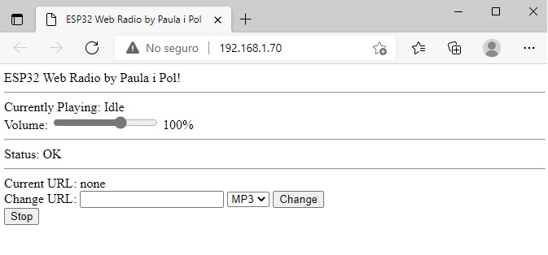

Pàgina web amb una ràdio:

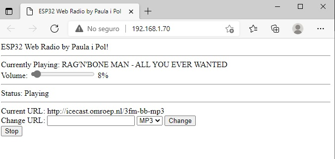

Pàgina web amb el botó de stop premés:

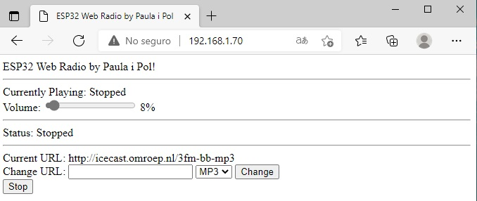

##### Vídeo

Per demostrar el funcionament d’aquesta pràctica adjuntem un vídeo el qual mostra el següent: 

El primer el funcionament correcte de la ràdio, després com es varia el volum, a continuació com canvia d'emissora, i per últim com actua en prémer el botó de stop:

https://drive.google.com/file/d/1ZY9VcRVzqHL0lrmBFgeLd5ahtRQFRhi7/view?usp=sharing

Com podem veure, i ja està comentat amb anterioritat hi ha interferències provocades en el procés que es poden apreciar en l’àudio.

##### Links ràdios

Adjuntem els dos links mostrats en la simulació. S’ha de comentar que no tots els links funcionen, per què el programa té restriccions en la mida d’aquests.

http://icecast.omroep.nl/3fm-bb-mp3

http://31.192.216.6/rmf_fm

##### Link llibreria

La llibreria utilitzada a la realització del projecte ha estat la següent, per ser específics ens hem basat  en el document Webradio.ino.

https://github.com/earlephilhower/ESP8266Audio

S’ha de dir que per fer funcionar el projecte correctament s’ha hagut de fer un parell de modificacions de fitxers secundaris. El primer ha estat al WiFiClient.cpp que s’ha comentat les línies de la 395 a la 401. I al web.cpp s’han comentat dos client.flush(), a les línies 181 i 206. Aquests canvis s’han realitzat pel fet que la llibreria tot i estar dissenyada per les plaques ESP32 i ESP8266 hi ha parts d’aquesta que estan configurats només per un funcionament perfecte de la segona. 

Document WiFiClient.cpp:

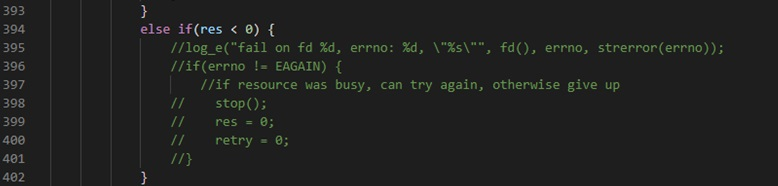

Document web.cpp:

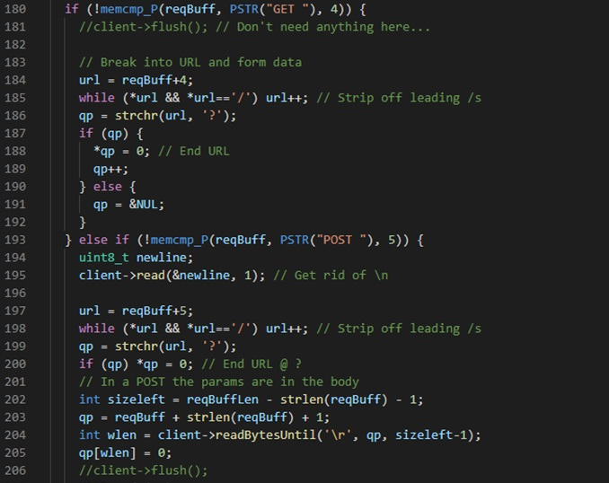

S'adjunten en l'apartat general de la carpeta Paula-Muncunill-i-Pol-Naharro-webradio-treball-final els dos documents de la llibreria que s'han editat.